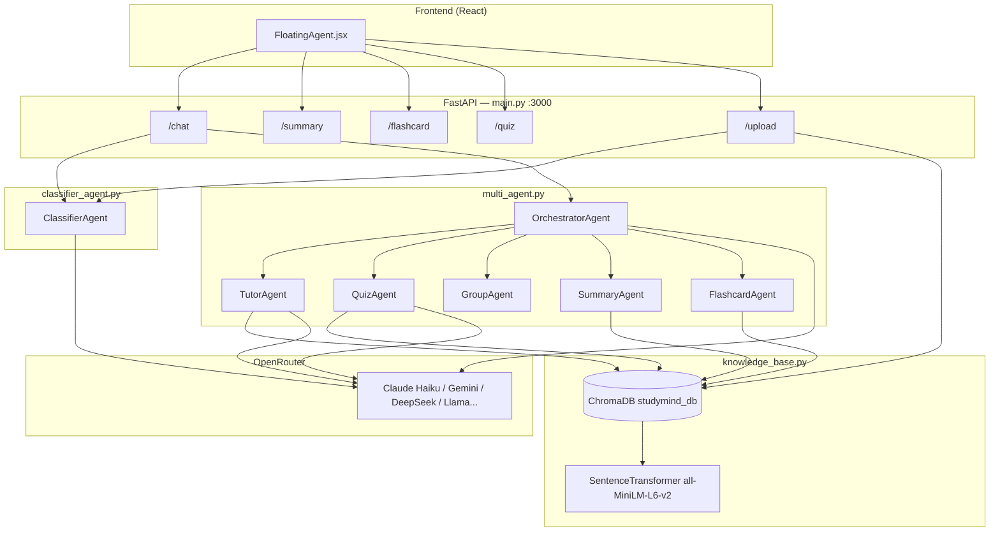

# StudyMind AI Agent — Cấu trúc, đánh giá và hướng tối ưu

> Tài liệu tham chiếu cho đồ án **StudyMind** (StudyMate AI).  
> Phiên bản hệ thống: **API v3.1** · Cập nhật: 2026-05-30

---

## 1. Tổng quan kiến trúc

Hệ thống AI Agent của bạn theo mô hình **Orchestrator + Specialist Agents** (multi-agent có điều phối), kết hợp **RAG** qua ChromaDB và **Classifier** để gắn metadata môn học.



**Luồng chat điển hình:**

1. User gửi câu hỏi → `POST /chat`
2. `ClassifierAgent` phân loại môn/chủ đề (confidence, subject_code)
3. Inject `[CONTEXT MÔN HỌC]` + `kb_filter` (ChromaDB where) vào Orchestrator
4. Orchestrator (LLM + tools) chọn `delegate_to_*` hoặc trả lời trực tiếp
5. Sub-agent có thể gọi `search_knowledge` → RAG từ tài liệu đã upload
6. Lưu history theo `session_id` (tối đa 20 message)

**Luồng upload:**

1. `POST /upload` → đọc PDF/DOCX/TXT
2. Classify → `ingest_pdf_async` → chunk 500 ký tự, overlap 50
3. Metadata: subject, topic, keywords, difficulty, …

---

## 2. Cấu trúc thư mục `ai_agent/`

| File | Vai trò | Trạng thái |
|------|---------|------------|
| `main.py` | FastAPI: endpoints, session, parse JSON quiz/flashcard, fetch file từ URL | **Production** |
| `multi_agent.py` | BaseAgent, 5 specialist + Orchestrator, tool loop, fallback model | **Production** |
| `classifier_agent.py` | Phân loại môn học, `build_kb_filter`, metadata ChromaDB | **Production** |
| `knowledge_base.py` | ChromaDB ingest/search, chunking | **Production** |
| `agent_with_tools.py` | Prototype Anthropic sync (Phase 1) | **Legacy / tham khảo** |
| `system_prompt.py` | Prompt cũ (nếu còn dùng riêng) | Kiểm tra trước khi xóa |
| `studymind_db/` | Persistent Chroma (runtime) | Dữ liệu local |

**Frontend liên quan:** `frontend/src/components/FloatingAgent.jsx` → `http://localhost:3000`

---

## 3. Chi tiết từng lớp

### 3.1. `BaseAgent` (multi_agent.py)

Trái tim của mọi agent:

| Thuộc tính | Mô tả |
|------------|--------|
| `system_prompt` | Persona + quy tắc output (JSON cho Quiz/Flashcard) |
| `tools` | Function calling (OpenAI-compatible qua OpenRouter) |
| `run(message, context, history)` | Một request độc lập; `history` từ session |
| `_run_with_model` | Vòng lặp tối đa 5 lần tool-call |
| `FALLBACK_MODELS` | Tự chuyển model khi lỗi 402/credits |

**Tool execution:** `asyncio.gather` cho nhiều tool song song; `kb_search` chạy trong `run_in_executor` (sync → không block event loop).

**Context request:** Dùng `contextvars.ContextVar` để truyền `kb_filter` an toàn khi nhiều request đồng thời trên cùng singleton (đã tối ưu 2026-05-30).

### 3.2. OrchestratorAgent

| Tool delegate | Sub-agent | Khi nào dùng |
|---------------|-----------|--------------|
| `delegate_to_tutor` | TutorAgent | Giải thích, Socratic, không làm bài hộ |
| `delegate_to_quiz` | QuizAgent | Quiz Bloom's → JSON |
| `delegate_to_group` | GroupAgent | Nhóm học, phân vai |
| `delegate_to_summary` | SummaryAgent | Tóm tắt bullet/paragraph/outline/map |
| `delegate_to_flashcard` | FlashcardAgent | Spaced repetition → JSON |

**Singleton:** `get_orchestrator()` — một instance cho toàn app.

**Lưu ý thiết kế:** Chat đi qua Orchestrator (thêm 1 hop LLM). Endpoint `/summary`, `/flashcard`, `/quiz` gọi **trực tiếp** sub-agent → nhanh hơn, ít token hơn.

### 3.3. ClassifierAgent

**Output:** `ClassificationResult` (dataclass)

- `subject`, `subject_code` (14 môn + other)
- `topic`, `keywords`, `content_type`, `difficulty`, `language`
- `confidence` (0–1), `reasoning`

**`build_kb_filter(result, strict=False)`**

- `subject_code == "other"` → không filter
- `confidence < 0.75` (mặc định) → không filter (tránh loại nhầm môn)
- Ngược lại → `{"subject_code": {"$eq": "..."}}`

**Tích hợp chat:** `/chat` gọi `classify_message` → inject hint + truyền `kb_filter` vào Orchestrator (đã nối wire 2026-05-30).

### 3.4. Knowledge Base

- **Embedding:** `all-MiniLM-L6-v2` (offline, nhẹ)
- **Chunk:** 500 chars, overlap 50, bỏ chunk < 50 chars
- **Search:** cosine similarity; hỗ trợ `where_filter` theo môn

### 3.5. API Endpoints (main.py)

| Method | Path | Agent / logic |
|--------|------|----------------|
| GET | `/` | Health |
| POST | `/chat` | Orchestrator + classify |
| POST | `/upload` | Ingest + classify |
| POST | `/summary` | SummaryAgent trực tiếp |
| POST | `/flashcard` | FlashcardAgent + `parse_flashcards` |
| POST | `/quiz` | QuizAgent batch ≤15, `asyncio.gather` |
| GET | `/subjects` | SUBJECT_MAP |
| GET | `/agents` | Danh sách agent |
| DELETE | `/history` | Xóa session in-memory |

**Parser:** `_extract_json` + regex fallback cho quiz/flashcard khi model không tuân JSON thuần.

---

## 4. Ưu điểm (điểm mạnh cho đồ án)

1. **Kiến trúc rõ ràng, dễ demo:** Orchestrator + agent chuyên biệt — giảng viên/hội đồng dễ hiểu “multi-agent”.
2. **RAG thực tế:** Upload → classify → metadata → search có filter môn — không chỉ prompt chung chung.
3. **Pedagogy có căn cứ:** Socratic (Tutor), Bloom (Quiz), spaced repetition (Flashcard) — phù hợp sản phẩm giáo dục.
4. **Async + singleton:** Phù hợp FastAPI; tránh khởi tạo lại agent mỗi request.
5. **Fallback model:** Giảm downtime khi hết credit OpenRouter.
6. **Dual path cho nội dung dài:** `file_url` + block `NỘI DUNG TÀI LIỆU` → tránh search KB khi đã có text (tiết kiệm token, chính xác hơn).
7. **Quiz scale:** Chia batch 15 câu, dedupe theo 50 ký tự đầu câu hỏi.
8. **Classifier tách module:** Có thể test độc lập (`python classifier_agent.py`).

---

## 5. Nhược điểm và rủi ro

| # | Vấn đề | Mức độ | Ghi chú |
|---|--------|--------|---------|
| 1 | **Chat qua Orchestrator** | Trung bình | Thêm latency + token; routing LLM có thể delegate sai |
| 2 | **Session in-memory** | Cao (scale) | Mất khi restart; không chia sẻ giữa nhiều worker uvicorn |
| 3 | **Không có memory dài hạn user** | Trung bình | Chỉ 20 message/session; không profile học sinh |
| 4 | **JSON output không ép schema** | Trung bình | Quiz/Flashcard phụ thuộc prompt + parser regex |
| 5 | **Chunk cố định 500 ký tự** | Trung bình | Có thể cắt giữa công thức/câu; chưa semantic chunk |
| 6 | **Classifier 2 lần LLM/chat** | Thấp–TB | classify + orchestrator (+ sub-agent) → chi phí |
| 7 | **`agent_with_tools.py` legacy** | Thấp | Dễ nhầm khi bảo trì |
| 8 | **CORS `*`, không auth API** | Cao (deploy) | Chỉ phù hợp dev/local |
| 9 | **ConfirmClassificationRequest** | Thấp | Schema có trong main nhưng chưa thấy endpoint xác nhận môn |
| 10 | **Comment “1000 users”** | — | Cần Redis/session + rate limit thật sự |

---

## 6. Đã tối ưu trong phiên đánh giá này

1. **`/chat` truyền `kb_filter`** — `build_kb_filter` trước đây import nhưng không dùng; sub-agent search KB đúng môn khi confidence ≥ 0.75.
2. **`contextvars` thay `self._current_context`** — Tránh race condition khi nhiều user chat đồng thời trên singleton.

---

## 7. Khuyến nghị tối ưu tiếp theo (theo ưu tiên)

### P0 — Nên làm trước khi bảo vệ đồ án

1. **Routing hybrid cho `/chat`**
   - Nếu `classify_message` confidence cao + intent rõ (quiz/summary/flashcard/tutor) → gọi thẳng sub-agent (giống `/quiz`).
   - Chỉ dùng Orchestrator khi intent mơ hồ hoặc multi-step.

2. **Structured output**
   - Bật `response_format: json_object` (nếu model hỗ trợ) cho Quiz/Flashcard.
   - Hoặc Pydantic validate + 1 lần retry khi parse fail.

3. **Endpoint xác nhận môn sau upload**
   - Implement `POST /classification/confirm` cập nhật metadata ChromaDB khi `needs_confirmation`.

### P1 — Chất lượng trả lời “thông minh hơn”

4. **Re-rank / tăng `n_results`** khi KB lớn; hiển thị `sources` trong response chat.
5. **Chunk theo đoạn** (paragraph/heading) thay vì fixed 500 chars.
6. **Inject RAG vào Tutor prompt** dạng citation: “Theo tài liệu X, trang …”.

### P2 — Production

7. Session Redis + `session_id` signed cookie.
8. Rate limiting, API key, CORS theo domain FE.
9. Logging có `request_id`, agent name, model used, token estimate.
10. Xóa hoặc archive `agent_with_tools.py` → `docs/legacy/`.

---

## 8. Ma trận “ai nào trả lời gì”

| Ý định user (ví dụ) | Đường đi hiện tại | Agent thực thi |
|----------------------|-------------------|----------------|
| “Giải thích đạo hàm” | /chat → Orchestrator → tutor | TutorAgent + KB |
| “Tạo 10 câu quiz” | /quiz trực tiếp | QuizAgent |
| “Tóm tắt file PDF” | /summary + file_url | SummaryAgent |
| “5 flashcard công thức” | /flashcard | FlashcardAgent |
| “Chia nhóm 4 người” | /chat → group | GroupAgent |
| Upload slide Toán | /upload | Classifier + ChromaDB |

---

## 9. Biến môi trường

```env
OPENAI_API_KEY=sk-or-...     # OpenRouter API key
MODEL=anthropic/claude-haiku-4-5
```

Chạy:

```bash
cd ai_agent
pip install fastapi uvicorn httpx python-docx pypdf chromadb sentence-transformers openai python-dotenv
python main.py
```

---

## 10. Cách kiểm tra nhanh sau tối ưu

```bash
# Classifier
python classifier_agent.py

# KB search có filter
python knowledge_base.py --search "đạo hàm" --subject math

# API
curl -X POST http://localhost:3000/chat -H "Content-Type: application/json" \
  -d "{\"text\": \"Đạo hàm của x^2 là gì?\"}"
```

Kiểm tra log: Orchestrator delegate → Tutor → `search_knowledge` với `where` subject_code phù hợp.

---

## 11. Kết luận chuyên gia

Hệ thống **ai_agent** của bạn đã vượt mức “chatbot một prompt”: có **điều phối đa agent**, **RAG có metadata môn học**, và **API tách endpoint theo tác vụ học tập**. Đây là nền tảng tốt cho đồ án StudyMind.

Để “tư vấn viên trả lời thông minh hơn”, tập trung vào ba trục:

1. **Giảm hop LLM thừa** (routing thông minh, không luôn qua Orchestrator).
2. **RAG chính xác** (kb_filter, chunk tốt, trích dẫn nguồn).
3. **Output tin cậy** (JSON có cấu trúc + validate).

File này là tài liệu sống — nên cập nhật khi bạn thêm agent mới (ví dụ: `ExamAgent`, `PlannerAgent`) hoặc đổi sang LangGraph/LlamaIndex.

---

*Tác giả tài liệu: đánh giá kiến trúc AI Agent · StudyMind · 2026*
