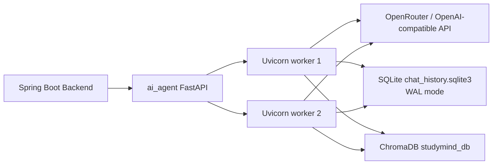

# Trien khai ai_agent cho khoang 100 nguoi dung

## 1. Muc tieu nang cap

Muc tieu cua dot nang cap nay la dua `ai_agent` tu trang thai demo/local sang trang thai co the deploy on dinh cho quy mo nho, khoang 100 nguoi dung. Cac thay doi tap trung vao:

- Luu lich su chat ben vung thay vi luu trong RAM.
- Gioi han so request LLM dong thoi de tranh qua tai provider.
- Chay nhieu worker Uvicorn.
- Mount volume rieng cho vector DB va chat DB.
- Loai bo code prototype khong con dung.
- Giam nguy co copy secret/local artifact vao Docker image.

## 2. Kien truc sau nang cap



## 3. Luu lich su chat

Truoc day, `ai_agent` luu history trong bien global `sessions`. Cach nay co 3 van de:

- Restart service se mat lich su.
- Nhieu worker/container se khong chia se memory.
- Kho quan ly va debug session.

Sau nang cap, history duoc luu bang SQLite tai `CHAT_DB_PATH`, mac dinh trong Docker la:

```text
/app/data/chat_history.sqlite3
```

SQLite duoc cau hinh WAL mode, phu hop voi workload nho: nhieu read, write ngan theo tung turn chat. Moi session chi giu toi da `MAX_SESSION_MESSAGES` message gan nhat de tranh DB tang qua nhanh.

## 4. Cau hinh Docker quan trong

Trong `docker-compose.yml`, `ai-agent` co cac bien:

```env
CHAT_DB_PATH=/app/data/chat_history.sqlite3
MAX_SESSION_MESSAGES=40
LLM_CONCURRENCY_LIMIT=12
LLM_REQUEST_TIMEOUT=60
UVICORN_WORKERS=2
STUDYMIND_DB_PATH=/app/studymind_db
```

Volume:

```yaml
ai_agent_db: /app/studymind_db
ai_agent_data: /app/data
```

`ai_agent_db` luu ChromaDB. `ai_agent_data` luu chat history.

## 5. Kha nang chiu tai muc 100 nguoi dung

Voi cau hinh mac dinh:

- `UVICORN_WORKERS=2`: co 2 process FastAPI xu ly request.
- `LLM_CONCURRENCY_LIMIT=12`: moi worker gioi han toi da 12 LLM call dong thoi.
- Tong muc dong thoi toi da ly thuyet: khoang 24 LLM calls cung luc.

Voi 100 nguoi dung, khong phai ai cung goi AI cung mot thoi diem. Cau hinh nay phu hop neu muc su dung dong thoi thuc te khoang 10-25 request AI cung luc. Neu traffic tang, co the tang worker hoac tach them replica, nhung can chuyen chat store sang Redis/PostgreSQL de chia se tot hon giua nhieu container.

## 6. Giam token nhung giu chat luong

He thong duoc bo sung cac co che tiet kiem token:

- Chi dua mot so message gan nhat vao LLM qua `CHAT_HISTORY_FOR_LLM`.
- Cat ngan tung message qua `MAX_MESSAGE_CHARS`.
- Gioi han tong prompt bang `MAX_PROMPT_CHARS`.
- Giam so ket qua RAG mac dinh bang `DEFAULT_KB_RESULTS`.
- Cat ngan context RAG bang `MAX_KB_CONTEXT_CHARS` va `MAX_KB_SOURCE_CHARS`.
- Giam output token mac dinh bang `LLM_MAX_OUTPUT_TOKENS`, nhung van co nguong rieng cho Quiz/Flashcard de JSON khong bi cut.

Cach nay khong chi cat token co hoc. He thong van giu cac phan quan trong: system prompt, request hien tai, history gan nhat va source RAG co lien quan.

## 7. BYOK: nguoi dung dung API key rieng

`ai_agent /chat` ho tro truong `api_key`. Neu nguoi dung nhap OpenRouter API key rieng, request se dung key do thay vi key he thong. Key nay:

- Khong dua vao prompt gui cho model.
- Khong luu vao chat history.
- Chi dung de tao OpenAI-compatible client cho request hien tai.

FloatingAgent luu key trong `localStorage` cua trinh duyet nguoi dung. Dieu nay giup giam rate-limit khi dung model mien phi tren OpenRouter, vi moi nguoi dung co quota rieng.

## 8. Code du thua da loai bo

Da xoa cac file prototype khong con duoc import:

- `ai_agent/agent_with_tools.py`
- `ai_agent/system_prompt.py`

Dong thoi them `.dockerignore` de khong copy vao image:

- `.env`
- `studymind-env/`
- `studymind_db/`
- `data/`
- `__pycache__/`
- file SQLite/local DB

## 9. Gioi han con lai

Kien truc hien tai phu hop deploy quy mo nho. Neu muon scale cao hon, can nang cap tiep:

- Doi SQLite chat store sang Redis/PostgreSQL.
- Doi ChromaDB local sang vector DB server-based neu chay nhieu replica.
- Them auth token giua backend va `ai_agent`.
- Them metrics chi tiet: latency, token usage, model error rate.
- Them queue cho tac vu nang nhu ingest tai lieu lon.

## 10. De xuat cau hinh production nho

De deploy ban dau:

- 1 container backend.
- 1 container `ai_agent` voi 2 workers.
- 1 container `ml_service`.
- 1 MongoDB.
- Volume rieng cho uploads, ChromaDB, chat DB.
- Reverse proxy Nginx/Caddy terminate HTTPS.

Neu LLM provider bi rate limit, giam `LLM_CONCURRENCY_LIMIT` xuong 6-8. Neu CPU/RAM du va provider cho phep, tang len 16.
