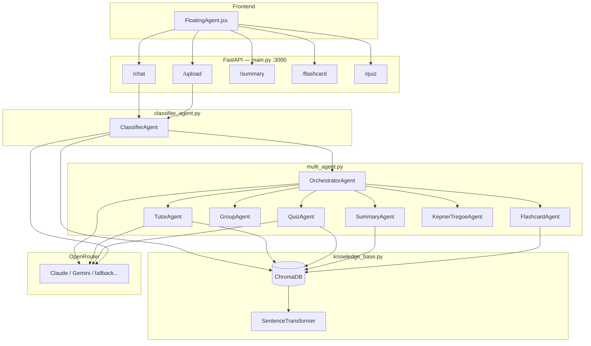
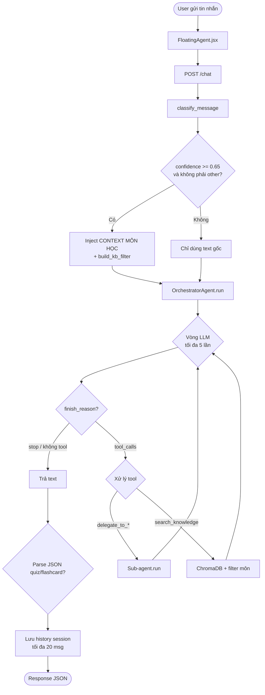
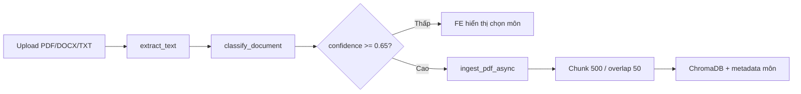
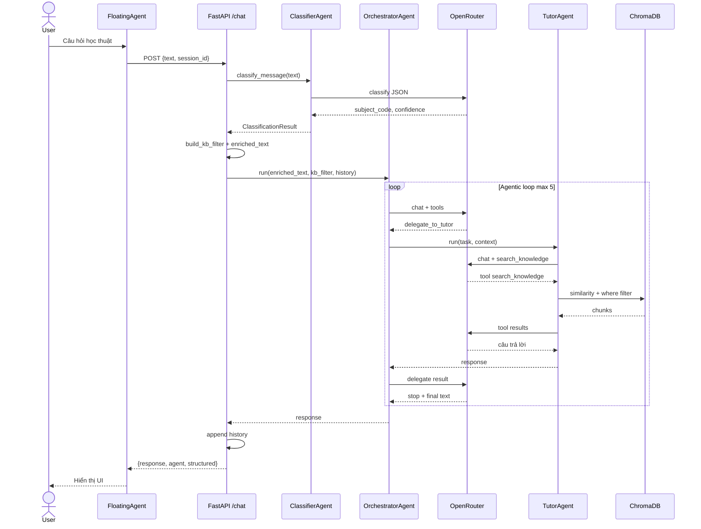
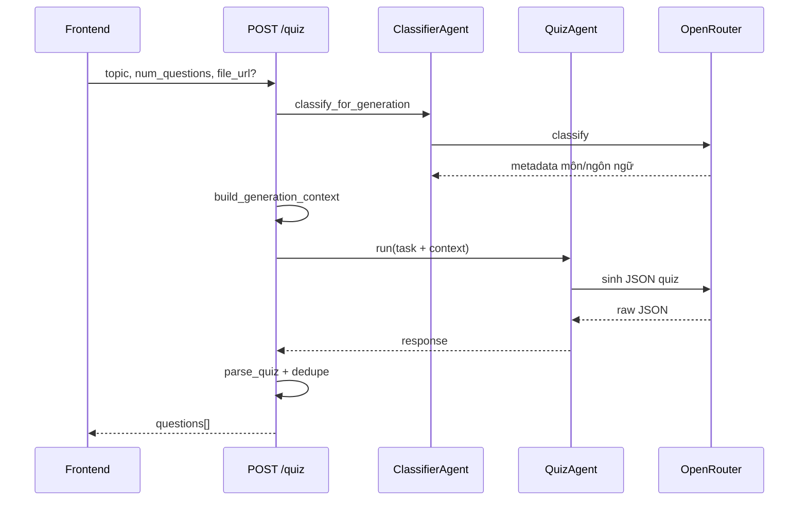
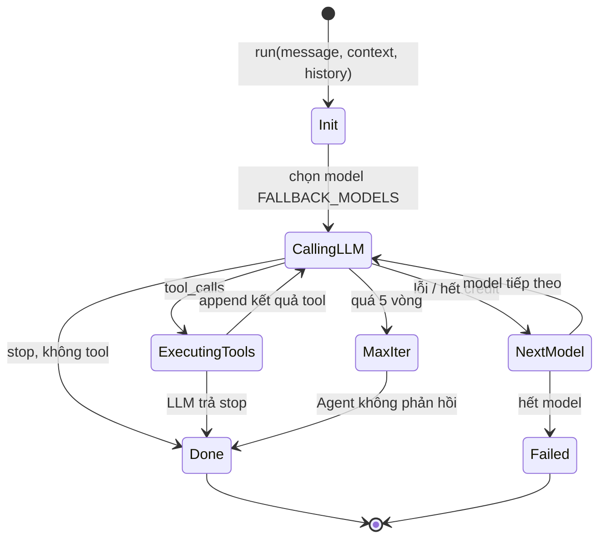
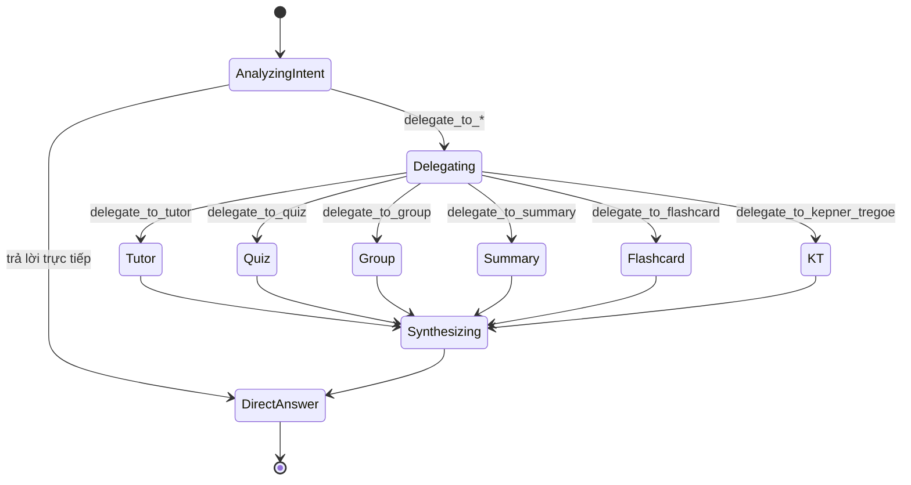
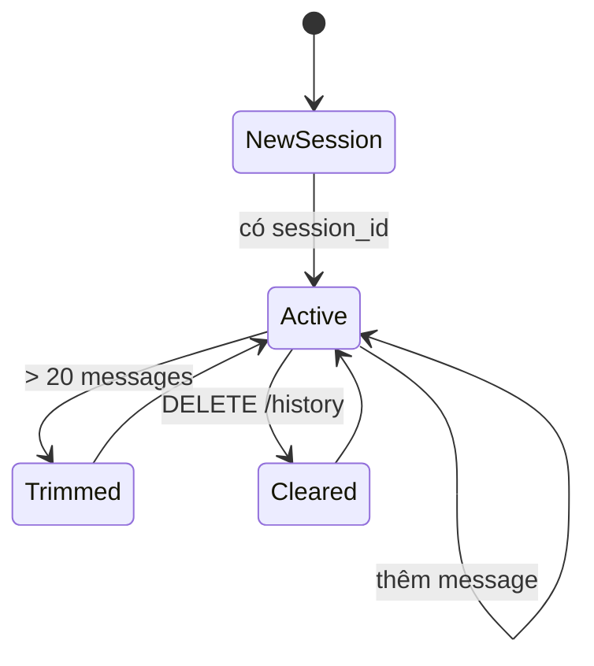

# StudyMind — AI Agent: Kiến thức, sơ đồ và đánh giá

> Tài liệu cho đồ án **StudyMate AI / StudyMind**  
> Phiên bản hệ thống tham chiếu: **API v3.2** · Cập nhật: 2026-06-01  
> Mã nguồn: `DoAnTotNghiep_studymate-ai/ai_agent/`

Tài liệu kỹ thuật chi tiết từng module: [`ai_agent/AI_AGENT_CAU_TRUC_VA_DANH_GIA.md`](../ai_agent/AI_AGENT_CAU_TRUC_VA_DANH_GIA.md)

---

## Mục lục

1. [Kiến thức cần biết để xây dựng AI Agent](#1-kiến-thức-cần-biết-để-xây-dựng-ai-agent)
2. [Kiến trúc StudyMind (tóm tắt)](#2-kiến-trúc-studymind-tóm-tắt)
3. [Sơ đồ hoạt động (Activity)](#3-sơ-đồ-hoạt-động-activity)
4. [Sơ đồ tuần tự (Sequence)](#4-sơ-đồ-tuần-tự-sequence)
5. [Sơ đồ trạng thái (State)](#5-sơ-đồ-trạng-thái-state)
6. [Ma trận agent ↔ use case](#6-ma-trận-agent--use-case)
7. [Đánh giá mức độ phù hợp đồ án](#7-đánh-giá-mức-độ-phù-hợp-đồ-án)
8. [Gợi ý trình bày khi bảo vệ](#8-gợi-ý-trình-bày-khi-bảo-vệ)
9. [Kiểm tra nhanh](#9-kiểm-tra-nhanh)

---

## 1. Kiến thức cần biết để xây dựng AI Agent

### 1.1. Định nghĩa (trong ngữ cảnh đồ án)

**AI Agent** là hệ thống dùng mô hình ngôn ngữ lớn (LLM) kết hợp **vòng lặp quyết định**:

```
Nhận input → Suy luận → (Gọi tool / Ủy quyền agent khác) → Lặp → Trả output cuối
```

Khác với chatbot một lần gọi API: agent có thể **gọi nhiều tool**, **tra cứu tri thức (RAG)**, và **điều phối nhiều chuyên gia (multi-agent)**.

### 1.2. Các thành phần cốt lõi

| Thành phần | Vai trò | Trong StudyMind |
|------------|---------|-----------------|
| **LLM** | Suy luận, sinh văn bản, chọn tool | OpenRouter (`OPENAI_API_KEY`, `MODEL`) |
| **System prompt** | Persona, quy tắc output | Mỗi class `*Agent` trong `multi_agent.py` |
| **Tools (function calling)** | Hành động có cấu trúc | `search_knowledge`, `delegate_to_*` |
| **RAG** | Trả lời bám tài liệu người dùng | ChromaDB + `all-MiniLM-L6-v2` |
| **Router / Classifier** | Chọn ngữ cảnh, lọc KB | `ClassifierAgent` (`classifier_agent.py`) |
| **Orchestrator** | Phân công tác vụ | `OrchestratorAgent` |
| **API & Session** | Giao tiếp FE, lịch sử hội thoại | FastAPI `main.py`, `sessions` dict |
| **Parser** | Chuẩn hóa JSON quiz/flashcard | `parse_quiz`, `parse_flashcards` |

### 1.3. Pattern kiến trúc đang áp dụng

1. **Orchestrator + Specialist Agents** — một agent điều phối, nhiều agent chuyên biệt.
2. **Agentic loop** — tối đa 5 vòng LLM ↔ tool trong `BaseAgent._run_with_model`.
3. **RAG có metadata môn học** — upload → classify → chunk → search với `kb_filter`.
4. **Dual path API** — `/chat` qua Orchestrator; `/quiz`, `/flashcard`, `/summary` gọi thẳng sub-agent.
5. **Stateless agent** — mỗi `run()` độc lập; `contextvars` truyền `kb_filter` an toàn khi concurrent.

### 1.4. Kiến thức bổ sung nên nắm khi bảo vệ

- **Prompt engineering**: Socratic (Tutor), Bloom (Quiz), spaced repetition (Flashcard).
- **Tool design**: mô tả tool rõ để LLM không delegate sai.
- **RAG**: chunk 500 ký tự / overlap 50; filter `subject_code` khi `confidence ≥ 0.75`.
- **Async**: `asyncio.gather` cho tool song song; `run_in_executor` cho search sync.
- **Đánh giá hệ thống**: latency, số lần gọi LLM, độ đúng phân loại môn, chất lượng JSON output.

---

## 2. Kiến trúc StudyMind (tóm tắt)



### Cấu trúc thư mục `ai_agent/`

| File | Vai trò |
|------|---------|
| `main.py` | FastAPI endpoints, session, parser |
| `multi_agent.py` | BaseAgent, Orchestrator, 6 specialist |
| `classifier_agent.py` | Phân loại môn, `build_kb_filter` |
| `knowledge_base.py` | Ingest / search ChromaDB |
| `vocabulary.py` | Từ vựng, extract, chuyển quiz/flashcard |
| `agent_with_tools.py` | Prototype cũ (tham khảo) |

---

## 3. Sơ đồ hoạt động (Activity)

### 3.1. Luồng chat (`POST /chat`)



### 3.2. Luồng upload tài liệu (`POST /upload`)



---

## 4. Sơ đồ tuần tự (Sequence)

### 4.1. Chat — giải thích bài học (qua Tutor + RAG)



### 4.2. Quiz trực tiếp (không qua Orchestrator)



---

## 5. Sơ đồ trạng thái (State)

### 5.1. Vòng đời một request trong `BaseAgent`



### 5.2. Orchestrator — routing intent



### 5.3. Session chat (in-memory)



> **Lưu ý:** Session mất khi restart server — phù hợp dev/demo, chưa production scale.

---

## 6. Ma trận agent ↔ use case

| Ý định người dùng | Endpoint | Agent thực thi |
|-------------------|----------|----------------|
| Giải thích khái niệm / Socratic | `/chat` | Orchestrator → TutorAgent (+ KB) |
| Tạo quiz ôn tập | `/quiz` hoặc `/chat` | QuizAgent |
| Tóm tắt tài liệu | `/summary` + `file_url` | SummaryAgent |
| Flashcard / ôn từ | `/flashcard` | FlashcardAgent |
| Chia nhóm / lịch học | `/chat` | GroupAgent |
| Phân tích IS/IS NOT (KT) | `/chat` | KepnerTregoeAgent |
| Upload slide / PDF | `/upload` | Classifier + ChromaDB ingest |

### Tool delegate của Orchestrator

| Tool | Sub-agent |
|------|-----------|
| `delegate_to_tutor` | TutorAgent |
| `delegate_to_quiz` | QuizAgent |
| `delegate_to_group` | GroupAgent |
| `delegate_to_summary` | SummaryAgent |
| `delegate_to_flashcard` | FlashcardAgent |
| `delegate_to_kepner_tregoe` | KepnerTregoeAgent |

---

## 7. Đánh giá mức độ phù hợp đồ án

### 7.1. Kết luận

**Hệ thống AI Agent của StudyMind phù hợp và đủ mạnh cho đồ án tốt nghiệp** ở mức:

- Vượt chatbot một prompt (multi-agent + RAG + classifier + tool loop).
- Gắn domain giáo dục (Socratic, Bloom, flashcard, Kepner-Tregoe).
- Có demo end-to-end: FE → API → agent → KB.

### 7.2. Bảng chấm điểm (thang 5 sao)

| Tiêu chí | Đánh giá | Ghi chú |
|----------|----------|---------|
| Đúng đề tài giáo dục | ⭐⭐⭐⭐⭐ | Pedagogy rõ trong prompt từng agent |
| Kiến trúc multi-agent | ⭐⭐⭐⭐⭐ | Dễ vẽ sơ đồ, dễ giải thích hội đồng |
| RAG thực tế | ⭐⭐⭐⭐ | Có filter môn; chunk cố định còn đơn giản |
| Tách API theo tác vụ | ⭐⭐⭐⭐ | `/quiz`, `/flashcard` tối ưu; `/chat` nặng hơn |
| Độ tin cậy output JSON | ⭐⭐⭐ | Parser + regex fallback, chưa schema cứng |
| Scale / bảo mật | ⭐⭐ | Session RAM, CORS `*`, chưa auth API |
| Chi phí / latency chat | ⭐⭐⭐ | classify + orchestrator + sub-agent |

### 7.3. Điểm mạnh (nhấn khi bảo vệ)

1. Orchestrator + specialist — đúng mô hình “AI agent” trong tài liệu kỹ thuật.
2. Classifier + `kb_filter` — RAG có ngữ cảnh môn học, không search mù.
3. Stateless + `contextvars` — đã xử lý concurrent trên singleton.
4. Fallback model — ổn định khi demo OpenRouter.
5. Dual path API — thiết kế có chủ đích (chat vs task cố định).

### 7.4. Hạn chế & hướng cải thiện

| Ưu tiên | Đề xuất |
|---------|---------|
| P0 | Routing hybrid `/chat`: intent rõ → gọi thẳng sub-agent |
| P0 | Structured output JSON (schema + validate + retry) |
| P1 | Trích dẫn nguồn RAG trong câu trả lời Tutor |
| P1 | Chunk theo đoạn văn thay vì 500 ký tự cố định |
| P2 | Session Redis, rate limit, API key, CORS domain |

---

## 8. Gợi ý trình bày khi bảo vệ

### Cấu trúc slide / chương luận văn

1. **Lý thuyết**: Agent vs chatbot; tool use; RAG; multi-agent (1–2 trang + sơ đồ §3–§5).
2. **Thiết kế**: Bảng agent, tool, endpoint (§6).
3. **Triển khai**: Trích `BaseAgent._run_with_model`, `/chat`, `build_kb_filter`.
4. **Đánh giá**: 5–10 câu test theo môn; metric thời gian, đúng classify, parse JSON.

### Câu hội đồng thường gặp — gợi ý trả lời

| Câu hỏi | Hướng trả lời ngắn |
|---------|-------------------|
| Vì sao cần Orchestrator? | Phân công tác vụ học tập đa dạng trong một ô chat |
| Vì sao có Classifier riêng? | Lọc KB đúng môn, inject hint Socratic/Toán/Lý... |
| Agent có “nhớ” user không? | 20 message/session; chưa long-term memory |
| Khác chatbot ChatGPT? | RAG tài liệu lớp + agent chuyên + output quiz/flashcard có cấu trúc |

---

## 9. Kiểm tra nhanh

### Biến môi trường

```env
OPENAI_API_KEY=sk-or-...
MODEL=anthropic/claude-haiku-4-5
```

### Chạy service

```bash
cd ai_agent
pip install fastapi uvicorn httpx python-docx pypdf chromadb sentence-transformers openai python-dotenv
python main.py
```

### Test API

```bash
# Chat
curl -X POST http://localhost:3000/chat -H "Content-Type: application/json" ^
  -d "{\"text\": \"Đạo hàm của x^2 là gì?\"}"

# Classifier
cd ai_agent && python classifier_agent.py

# KB search
python knowledge_base.py --search "đạo hàm" --subject math
```

### Log cần thấy khi demo RAG

```
Orchestrator → delegate_to_tutor → TutorAgent → search_knowledge (where subject_code=math)
```

---

## Phụ lục: Endpoints chính

| Method | Path | Mô tả |
|--------|------|--------|
| POST | `/chat` | Orchestrator + classify + history |
| POST | `/upload` | Ingest + classify |
| POST | `/summary` | SummaryAgent trực tiếp |
| POST | `/flashcard` | FlashcardAgent + parse |
| POST | `/quiz` | QuizAgent batch |
| GET | `/agents` | Danh sách agent |
| DELETE | `/history` | Xóa session |

---

*Tài liệu xuất cho đồ án StudyMind · Có thể chèn sơ đồ Mermaid vào Word qua [Mermaid Live Editor](https://mermaid.live) hoặc extension Mermaid trong VS Code.*
