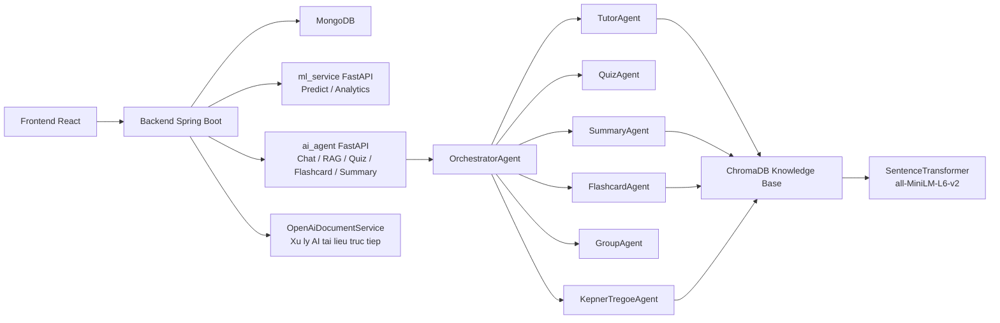
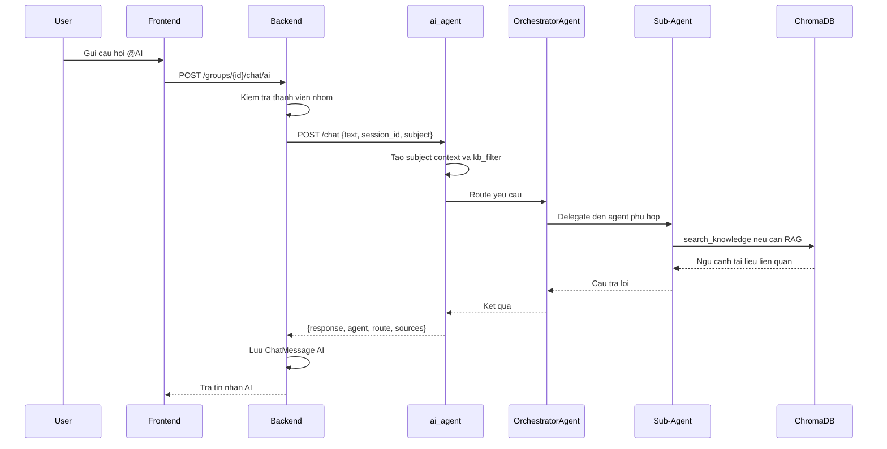

# Kien truc AI Agent StudyMate AI sau chinh sua

## 1. Muc tieu chinh sua

He thong ban dau co hai khoi Python: `ml_service` va `ai_agent`, nhung backend dang goi `/chat` vao `ml_service` trong khi `ml_service` chi phuc vu bai toan du doan hoc luc. Sau chinh sua, kien truc duoc tach ro:

- `ml_service`: phuc vu cac API du doan hoc luc nhu `/predict`, `/predict/batch`, `/health`.
- `ai_agent`: phuc vu cac tac vu AI tao sinh va agent nhu `/chat`, `/summary`, `/quiz`, `/flashcard`, `/upload`, `/vocabulary/*`, `/health`.
- `backend`: la API gateway va lop nghiep vu chinh, goi dung service theo tung loai tac vu.

## 2. Kien truc tong the

## 3. Vai tro tung thanh phan

### Frontend React

Frontend cung cap giao dien hoc tap, chat nhom, quan ly tai lieu, flashcard, quiz, thanh vien nhom va thong ke hoc tap. Frontend khong goi truc tiep AI provider ma thong qua backend de bao toan quyen truy cap va thong nhat du lieu.

### Backend Spring Boot

Backend la trung tam nghiep vu cua he thong. Cac chuc nang chinh gom:

- Quan ly nguoi dung, xac thuc, JWT, OAuth2.
- Quan ly nhom hoc, chat nhom, tin nhan rieng, thong bao.
- Quan ly tai lieu hoc tap, upload, folder, quiz, flashcard.
- Goi `ml_service` cho tac vu du doan hoc luc.
- Goi `ai_agent` cho tac vu hoi dap AI trong chat nhom va direct message.

Sau chinh sua, backend co hai cau hinh rieng:

- `app.ml-service.url`: tro den `ml_service`.
- `app.ai-agent.url`: tro den `ai_agent`.

Dieu nay giam phu thuoc cheo va tranh viec chat AI goi nham sang service du doan.

### ml_service

`ml_service` la FastAPI service gon, hien tai dung cho cac bai toan tinh toan/du doan hoc luc. Service nay khong con duoc xem la chatbot hoac agent service. Day la quyet dinh kien truc quan trong vi giu module du doan doc lap voi module LLM.

### ai_agent

`ai_agent` la AI service chinh. Service nay expose cac endpoint:

- `/chat`: hoi dap co dieu phoi agent.
- `/summary`: tom tat tai lieu hoac chu de.
- `/flashcard`: tao flashcard tu tai lieu, chu de hoac vocabulary pipeline.
- `/quiz`: tao cau hoi trac nghiem theo Bloom.
- `/upload`: nap tai lieu vao ChromaDB.
- `/vocabulary/*`: import, parse, trich xuat va chuyen doi tu vung.
- `/health`: healthcheck cho Docker/backend.

### ChromaDB Knowledge Base

ChromaDB luu tri vector cua tai lieu hoc tap sau khi chunking. Metadata gom subject, subject_code, topic, content_type, difficulty, language. Sau chinh sua, duong dan DB duoc cau hinh bang bien moi truong `STUDYMIND_DB_PATH`, phu hop khi chay Docker voi volume rieng.

## 4. Luong xu ly chat AI

Backend truyen `session_id` dang `group:{groupId}` cho chat nhom va `dm:{senderId}:{receiverId}` cho direct message, giup `ai_agent` tach lich su hoi thoai theo ngu canh.

## 5. Mo hinh multi-agent

`OrchestratorAgent` dong vai tro bo dieu phoi. Thay vi mot prompt duy nhat xu ly moi tac vu, he thong tach thanh cac agent chuyen biet:

- `TutorAgent`: giai thich kien thuc theo phong cach Socratic, co the dung RAG.
- `QuizAgent`: tao quiz theo Bloom, uu tien JSON structure.
- `SummaryAgent`: tom tat tai lieu theo bullet, paragraph, outline, map.
- `FlashcardAgent`: tao flashcard, ho tro JSON output.
- `GroupAgent`: tu van phan cong, to chuc hoc nhom.
- `KepnerTregoeAgent`: phan tich van de, nguyen nhan, quyet dinh, rui ro theo Kepner-Tregoe.

Cach tach nay giup prompt ngan hon, vai tro ro hon, de mo rong them agent moi.

## 6. Diem da cai thien

1. Tach ro `ml_service` va `ai_agent`.
   Truoc day backend goi `/chat` vao `ML_SERVICE_URL`, trong khi `ml_service` khong co endpoint `/chat`. Sau chinh sua, chat AI goi `AI_AGENT_URL`.

2. Them Dockerfile va requirements cho `ai_agent`.
   Agent service co the build va chay doc lap trong Docker.

3. Them healthcheck cho `ai_agent`.
   Endpoint `/health` giup Docker va backend kiem tra trang thai service.

4. Tach volume ChromaDB.
   ChromaDB dung volume `ai_agent_db`, tranh mat du lieu vector khi container restart.

5. Cau hinh DB bang bien moi truong.
   `STUDYMIND_DB_PATH` giup he thong linh hoat giua local va Docker.

6. Backend adapter dung dung schema.
   Backend gui `{text, session_id, subject}` va doc truong `response`, dung voi API cua `ai_agent`.

## 7. Uu diem kien truc

- Phan tach trach nhiem ro rang: backend xu ly nghiep vu, `ml_service` xu ly du doan, `ai_agent` xu ly LLM/RAG.
- De mo rong: co the them agent moi ma khong anh huong backend nhieu.
- Co RAG theo mon hoc: tai lieu duoc gan metadata va search co filter `subject_code`.
- Co fallback model: tang kha nang hoat dong khi mot model/provider loi.
- Co structured output cho quiz/flashcard: phu hop voi yeu cau luu vao database va hien thi frontend.
- Co session rieng cho group/DM: hoi thoai AI khong bi tron ngu canh.

## 8. Han che con lai

- Session cua `ai_agent` van luu in-memory, chua phu hop khi scale nhieu instance. Nen chuyen sang Redis hoac MongoDB neu trien khai production.
- RAG hien dung chunking va semantic search co ban, chua co reranking hoac danh gia do tin cay nguon.
- `OpenAiDocumentService` trong backend van la duong AI truc tiep rieng cho tai lieu. Ve lau dai nen hop nhat ve `ai_agent` de thong nhat prompt, logging, quota va guardrail.
- Docker image cua `ai_agent` co dependency nang nhu `sentence-transformers`, can toi uu build cache va image size khi deploy that.
- Can bo sung auth/service token giua backend va `ai_agent` neu public network khong tin cay.

## 9. Huong phat trien tiep theo

- Dua session memory sang Redis.
- Them API ingest tai lieu tu backend sang `ai_agent` khi upload document.
- Them source citation bat buoc trong cau tra loi RAG.
- Them evaluation dataset cho quiz, summary va tutor answer.
- Hop nhat `OpenAiDocumentService` ve `ai_agent`.
- Them observability: request id, agent route log, token usage, latency, error rate.

