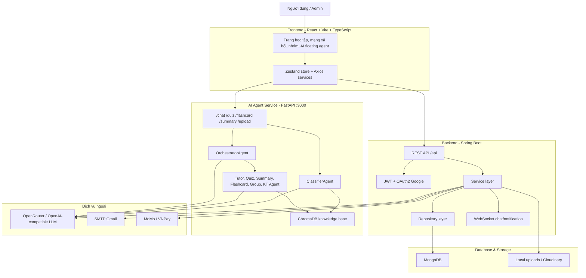
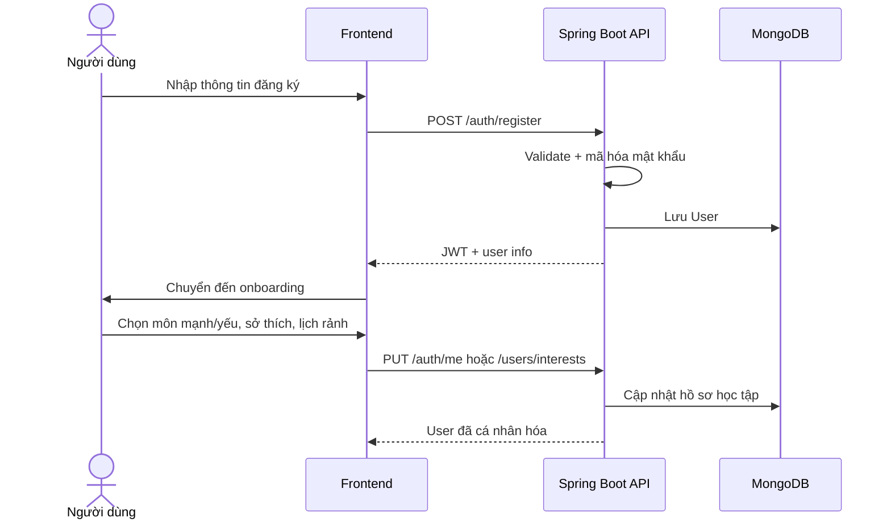
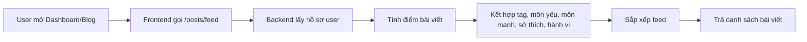
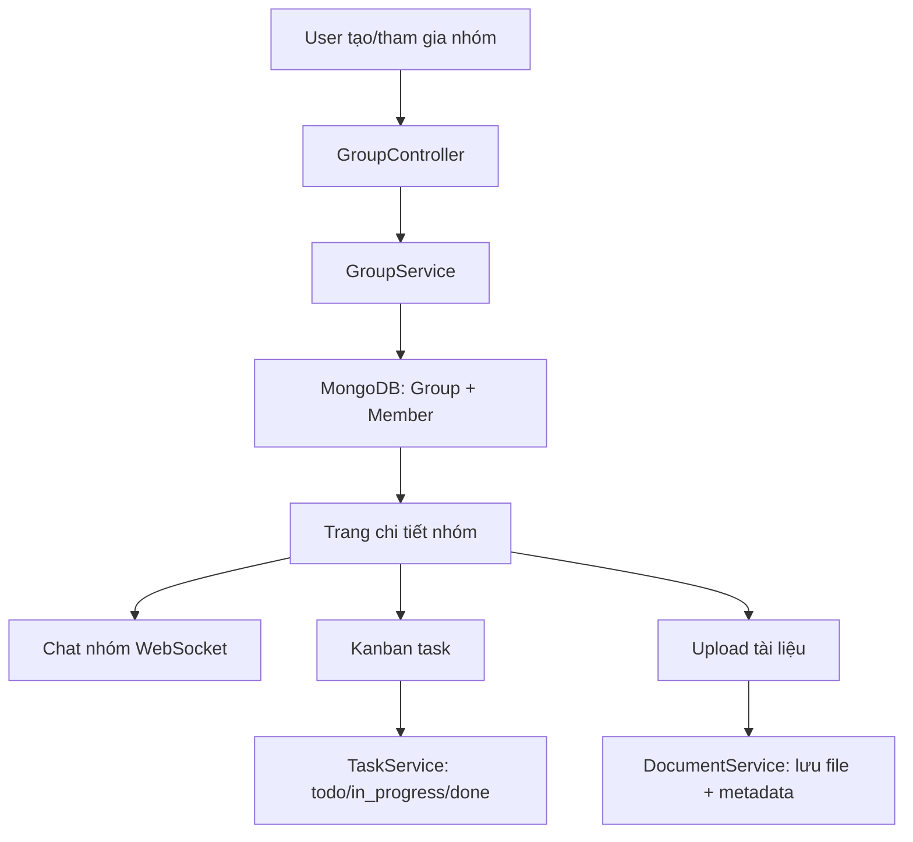
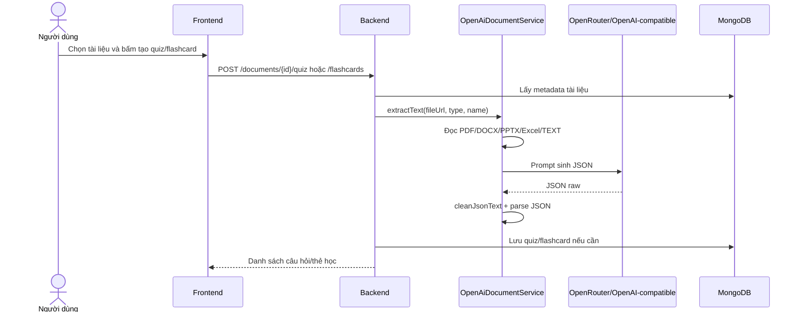
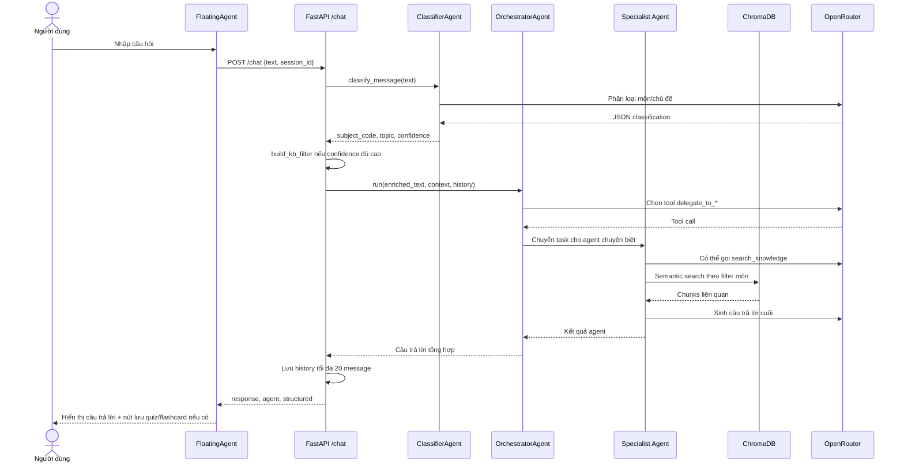
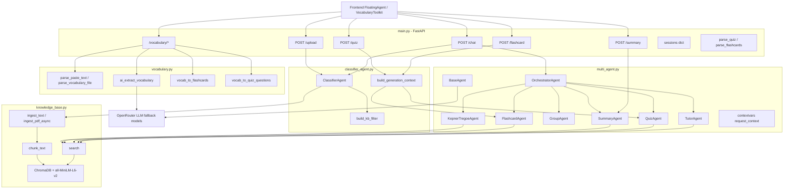
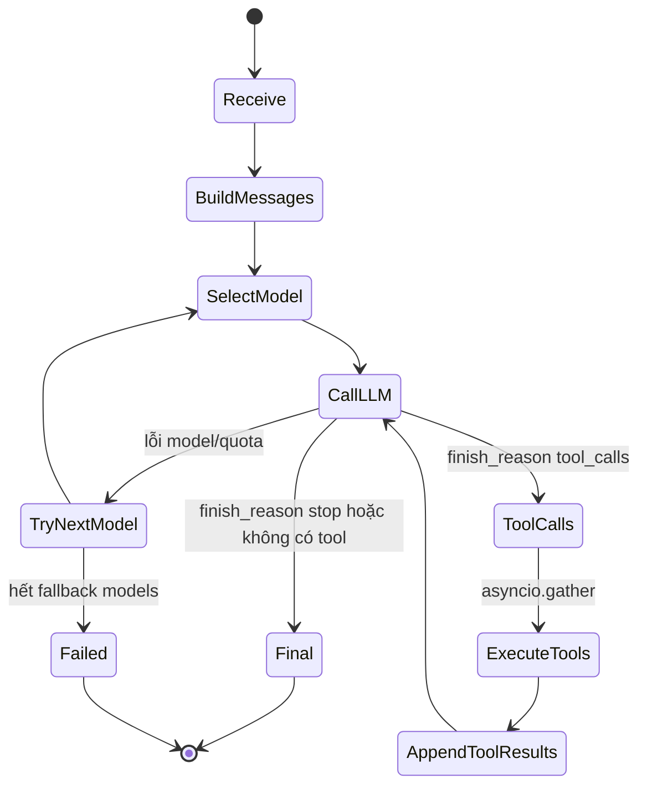
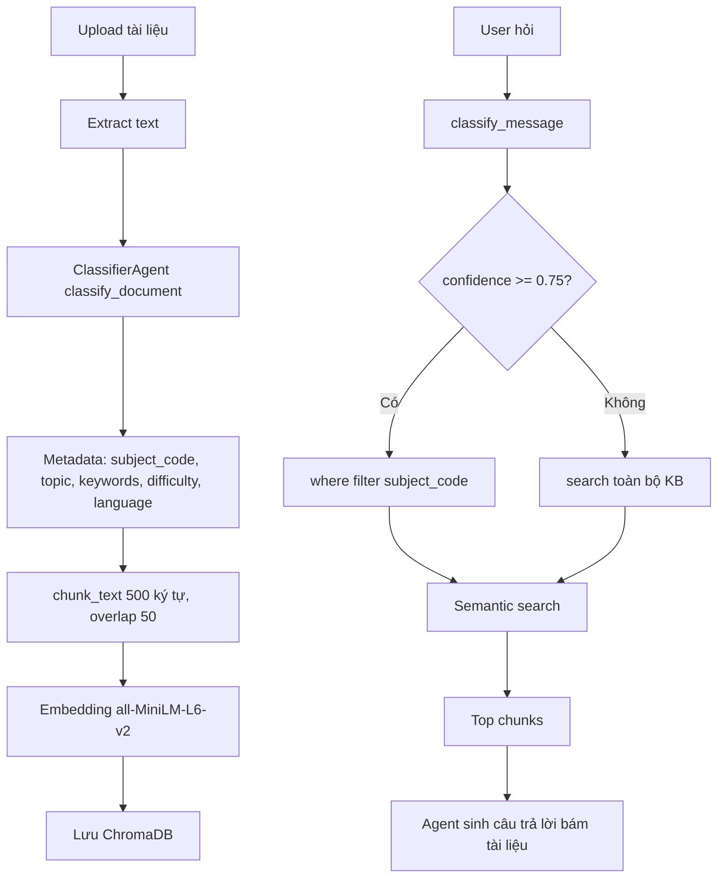
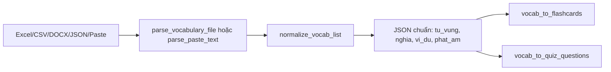

# Báo cáo mô hình hệ thống StudyMate AI

> Tài liệu gợi ý nội dung báo cáo đồ án: kiến trúc hệ thống, luồng dữ liệu người dùng,
> kiến trúc `ai_agent`, thuật toán và kiến thức nền cần trình bày trước hội đồng.

## 1. Nếu tôi là sinh viên báo cáo đồ án này, tôi sẽ nói gì?

### 1.1. Mở đầu

Đề tài của em là **StudyMate AI**, một nền tảng hỗ trợ học tập cá nhân và học tập nhóm. Hệ thống kết hợp mạng xã hội học tập, quản lý nhóm, tài liệu, flashcard, quiz và một trợ lý AI đa tác tử tên là **StudyMind**.

Vấn đề em muốn giải quyết là: sinh viên thường có nhiều tài liệu rời rạc, khó ôn tập có hệ thống, khó tìm bạn học phù hợp, khó theo dõi tiến độ và không có công cụ cá nhân hóa kế hoạch học. Vì vậy hệ thống được thiết kế để:

- Quản lý tài khoản, hồ sơ, môn mạnh, môn yếu, lịch rảnh.
- Tạo cộng đồng học tập: bài viết, kết bạn, nhóm, chat, task, tài liệu.
- Tự động tạo tóm tắt, quiz, flashcard từ tài liệu.
- Cung cấp AI agent có khả năng phân loại môn học, tra cứu tài liệu và điều phối nhiều agent chuyên biệt.

### 1.2. Điểm nhấn khi bảo vệ

Em sẽ nhấn mạnh 5 điểm:

1. **Kiến trúc tách lớp rõ ràng**: React frontend, Spring Boot backend, MongoDB và Python FastAPI AI agent.
2. **AI không chỉ là chatbot**: hệ thống dùng Orchestrator, specialist agents, function calling, RAG với ChromaDB và classifier môn học.
3. **Có thuật toán học tập cụ thể**: SM-2 cho flashcard, Bloom's Taxonomy cho quiz, weighted gap optimization cho kế hoạch học, hybrid recommendation cho feed/bạn học.
4. **Luồng nghiệp vụ đầy đủ**: đăng ký, học cá nhân, học nhóm, upload tài liệu, hỏi AI, lưu quiz/flashcard.
5. **Có khả năng mở rộng**: các service tách riêng, có thể thay model AI, thêm Redis/session, thêm vector search cho bài viết.

## 2. Mô hình tổng thể hệ thống



### 2.1. Vai trò từng khối

| Khối | Công nghệ | Vai trò |
|---|---|---|
| Frontend | React, Vite, TypeScript, Tailwind | Giao diện người dùng, gọi API, hiển thị chat AI, lưu quiz/flashcard |
| Backend | Spring Boot, Spring Security, WebSocket | Xử lý nghiệp vụ chính, auth, social, group, task, document, payment, admin |
| Database | MongoDB | Lưu user, post, group, task, quiz, flashcard, payment, notification |
| AI Agent | FastAPI, OpenRouter, ChromaDB | Chat đa tác tử, RAG, phân loại môn, sinh quiz/flashcard/tóm tắt |
| External | SMTP, Cloudinary, MoMo, VNPay, LLM API | Gửi mail, lưu media, thanh toán, gọi mô hình ngôn ngữ |

## 3. Các nhóm chức năng chính

### 3.1. Người dùng

- Đăng ký, đăng nhập, Google OAuth2, quên mật khẩu.
- Onboarding: chọn trường, ngành, mục tiêu, môn mạnh, môn yếu, lịch rảnh, sở thích.
- Hồ sơ cá nhân, avatar, ảnh bìa, cập nhật thông tin.

### 3.2. Mạng xã hội học tập

- Đăng bài, xem feed, trending, tìm kiếm, lưu bài, like, comment, share.
- Gợi ý bạn học dựa trên môn học, sở thích, lịch rảnh và năng lực hỗ trợ.
- Tin nhắn cá nhân, thông báo realtime.

### 3.3. Học nhóm

- Tạo nhóm, tham gia nhóm, phân quyền thành viên.
- Chat nhóm realtime, bài viết nhóm, duyệt bài.
- Kanban task nhóm, task cá nhân, deadline, submit bài, comment.
- Quản lý tài liệu nhóm và tài liệu cá nhân.

### 3.4. Công cụ học tập

- Flashcard cá nhân và flashcard sinh từ tài liệu.
- Quiz cá nhân và quiz sinh từ tài liệu.
- Tóm tắt tài liệu.
- Bộ công cụ từ vựng: import Excel/CSV/DOCX/JSON, trích xuất AI, chuyển sang quiz/flashcard.

### 3.5. Admin

- Quản lý user, nhóm, bài viết, tài liệu.
- Quản lý membership, doanh thu, cảnh báo, thông báo broadcast.
- Theo dõi dữ liệu người dùng, bài viết, nhóm, tài liệu, doanh thu và cảnh báo hệ thống.

## 4. Luồng dữ liệu người dùng

### 4.1. Luồng đăng ký và cá nhân hóa



Dữ liệu onboarding được dùng về sau cho:

- Feed bài viết.
- Gợi ý bạn học.
- Gợi ý nhóm.
- Cá nhân hóa nội dung học tập và gợi ý bạn học.

### 4.2. Luồng xem feed và gợi ý nội dung



Điểm feed sử dụng hybrid scoring:

- Trùng môn yếu: điểm cao nhất vì đây là nhu cầu cải thiện trực tiếp.
- Trùng sở thích: tăng khả năng tương tác.
- Trùng môn mạnh: giúp user chia sẻ/chuyên sâu.
- Hành vi like, save, comment, view làm tăng trọng số tag.
- Bài mới và bài thịnh hành được cộng thêm điểm.

### 4.3. Luồng học nhóm và task



### 4.4. Luồng tạo quiz/flashcard từ tài liệu trong backend



### 4.5. Luồng chat với StudyMind AI



## 5. Kiến trúc `ai_agent`

### 5.1. Tổng quan

`ai_agent` là service FastAPI riêng chạy ở cổng `3000`. Nó không phụ thuộc trực tiếp vào backend Spring Boot khi chat, mà frontend gọi thẳng qua `FloatingAgent.jsx` và `vocabularyApi`.

Các file quan trọng:

| File | Vai trò |
|---|---|
| `main.py` | Định nghĩa API `/chat`, `/upload`, `/summary`, `/flashcard`, `/quiz`, `/vocabulary/*` |
| `multi_agent.py` | BaseAgent, OrchestratorAgent, TutorAgent, QuizAgent, SummaryAgent, FlashcardAgent, GroupAgent, KepnerTregoeAgent |
| `classifier_agent.py` | Phân loại tài liệu/câu hỏi theo môn học, chủ đề, độ khó, ngôn ngữ |
| `knowledge_base.py` | ChromaDB persistent client, chunking, ingest, semantic search |
| `vocabulary.py` | Parse/import/trích xuất từ vựng, chuyển từ vựng sang quiz/flashcard |

### 5.2. Sơ đồ module AI agent



### 5.3. Orchestrator và specialist agents

Orchestrator là bộ điều phối. Khi người dùng hỏi, Orchestrator phân tích ý định rồi gọi đúng agent:

| Ý định | Tool | Agent |
|---|---|---|
| Giải thích khái niệm, giảng bài | `delegate_to_tutor` | TutorAgent |
| Tạo quiz, ôn tập | `delegate_to_quiz` | QuizAgent |
| Tổ chức nhóm, lịch học | `delegate_to_group` | GroupAgent |
| Tóm tắt bài học/tài liệu | `delegate_to_summary` | SummaryAgent |
| Tạo flashcard | `delegate_to_flashcard` | FlashcardAgent |
| Phân tích nguyên nhân, quyết định, rủi ro | `delegate_to_kepner_tregoe` | KepnerTregoeAgent |

Điểm quan trọng: các agent là **singleton** để không khởi tạo lại nhiều lần, nhưng từng request vẫn **stateless** vì message/context được truyền riêng vào `run()`.

### 5.4. Vòng lặp agentic loop



Thuật toán trong `BaseAgent.run()`:

1. Nhận `message`, `context`, `history`.
2. Gắn context vào request bằng `contextvars`.
3. Tạo `messages = system prompt + history + user message`.
4. Thử lần lượt các model fallback.
5. Nếu LLM trả lời trực tiếp thì kết thúc.
6. Nếu LLM gọi tool thì thực thi tool song song.
7. Thêm kết quả tool vào messages rồi gọi LLM tiếp.
8. Tối đa 5 vòng để tránh lặp vô hạn.

### 5.5. RAG với ChromaDB



Các điểm nên trình bày:

- Embedding model: `all-MiniLM-L6-v2`, nhẹ và chạy offline.
- Vector DB: ChromaDB persistent.
- Chunk size: 500 ký tự, overlap 50 để giữ ngữ cảnh giữa các đoạn.
- Metadata filter: lọc theo `subject_code` khi classifier đủ tự tin.
- RAG giúp AI trả lời theo tài liệu của hệ thống, không chỉ dựa vào kiến thức model.

### 5.6. ClassifierAgent

ClassifierAgent trả JSON gồm:

- `subject`: tên môn.
- `subject_code`: mã môn như `math`, `physics`, `programming`, `english`, `korean`.
- `topic`: chủ đề con.
- `keywords`: từ khóa.
- `content_type`: theory, exercise, exam, vocabulary, grammar, mixed.
- `difficulty`: basic, intermediate, advanced.
- `language`: vi, en, ko, ja, zh...
- `confidence`: độ tin cậy.

Classifier được dùng ở 3 nơi:

1. Upload tài liệu: gắn metadata vào ChromaDB.
2. Chat: inject context môn học và tạo `kb_filter`.
3. Sinh quiz/flashcard: tạo prompt phù hợp với môn/ngôn ngữ.

## 6. Các thuật toán trong hệ thống

### 6.1. SM-2 cho flashcard

File: `backend/src/main/java/com/studymate/util/Sm2Scheduler.java`

Mục tiêu: lên lịch ôn tập theo mức độ nhớ của người học.

Rating được đổi sang quality:

| Rating | Quality |
|---|---:|
| AGAIN | 1 |
| HARD | 3 |
| GOOD | 4 |
| EASY | 5 |

Quy tắc:

- Nếu quality < 3: reset repetitions về 0, interval = 1 ngày.
- Nếu lần nhớ đầu tiên: interval = 1 ngày.
- Nếu lần nhớ thứ hai: interval = 6 ngày.
- Nếu đã nhớ nhiều lần: interval = interval cũ × ease factor.
- Ease factor cập nhật theo công thức SM-2:

```text
EF' = EF + (0.1 - (5 - q) * (0.08 + (5 - q) * 0.02))
EF tối thiểu = 1.3
```

Ý nghĩa khi báo cáo: nếu người học chọn EASY/GOOD thì thẻ xuất hiện lại muộn hơn; nếu chọn AGAIN thì hệ thống cho ôn lại sớm.

### 6.2. Hybrid recommendation cho feed và bạn học

Tài liệu liên quan: `docs/recommendation-notes.md`

Hệ thống dùng scoring kết hợp:

```text
score = content_score + behavior_score + social_score + recency_score + popularity_score
```

Ví dụ trọng số:

- Bài viết trùng `weakSubjects`: +10.
- Trùng `interests`: +8.
- Trùng `strongSubjects`: +6.
- Like tag: +3.
- Bình luận: +2.
- Lưu bài: +5.
- Bài mới 48 giờ: +3.

Với gợi ý bạn học:

- Có môn chung.
- Cùng trường/loại người dùng.
- Lịch rảnh trùng nhau.
- Người A yếu môn X, người B mạnh môn X thì điểm ghép cặp tăng.

### 6.3. Bloom's Taxonomy cho quiz

QuizAgent sinh câu hỏi theo mức độ nhận thức:

| Bloom level | Dạng câu hỏi |
|---|---|
| remember | Nhớ định nghĩa, công thức |
| understand | Giải thích, mô tả bằng lời |
| apply | Áp dụng vào bài tập/tình huống |
| analyze | So sánh, phân tích nguyên nhân, giả thuyết |

Khi `/quiz` nhận `num_questions > 15`, hệ thống chia batch, gọi song song bằng `asyncio.gather`, sau đó gộp và loại trùng câu hỏi.

### 6.4. Vocabulary pipeline

Pipeline từ vựng:



Nếu có tài liệu dài, hệ thống có thể gọi LLM để trích xuất từ vựng theo schema JSON chuẩn.

### 6.5. Parser JSON và fallback regex

Vì LLM đôi khi trả markdown hoặc text thừa, `main.py` có các bước:

1. Xóa fence ```json.
2. Thử `json.loads`.
3. Nếu lỗi, dùng regex lấy object JSON đầu tiên.
4. Nếu vẫn lỗi, dùng regex fallback theo format câu hỏi/flashcard.
5. Validate trường bắt buộc trước khi trả frontend.

## 7. Kiến thức nền nên trình bày

### 7.1. AI Agent

AI Agent là chương trình dùng LLM để nhận mục tiêu, suy luận, chọn công cụ, thực thi công cụ và trả kết quả. Trong đồ án này, agent có:

- System prompt.
- Tool schema.
- Function calling.
- Memory ngắn hạn qua session history.
- RAG qua ChromaDB.
- Orchestrator điều phối nhiều specialist agents.

### 7.2. RAG

RAG là Retrieval-Augmented Generation:

```text
Tài liệu -> chia chunk -> embedding -> vector DB
Câu hỏi -> embedding/search -> lấy đoạn liên quan -> LLM trả lời dựa trên context
```

Lợi ích:

- Giảm hallucination.
- Trả lời theo tài liệu người dùng upload.
- Có thể cập nhật tri thức mà không cần train lại model.

### 7.3. Vector embedding và semantic search

Embedding biến văn bản thành vector số. Các đoạn có ý nghĩa gần nhau sẽ có vector gần nhau. ChromaDB tìm đoạn liên quan bằng khoảng cách cosine.

Trong hệ thống:

- Model embedding: `all-MiniLM-L6-v2`.
- Vector DB: ChromaDB.
- Relevance score: `1 - distance`.

### 7.4. Function calling

Function calling cho phép LLM không chỉ sinh text mà còn chọn gọi tool có schema rõ ràng. Ví dụ:

- `search_knowledge(query, n_results)`.
- `delegate_to_quiz(topic, bloom_level, num_questions)`.
- `delegate_to_flashcard(topic, card_type, num_cards)`.

### 7.5. Multi-agent

Thay vì một chatbot làm mọi việc, hệ thống chia thành nhiều agent:

- TutorAgent giỏi giải thích.
- QuizAgent giỏi tạo câu hỏi.
- SummaryAgent giỏi tóm tắt.
- FlashcardAgent giỏi tạo thẻ học.
- GroupAgent giỏi tư vấn học nhóm.
- KepnerTregoeAgent giỏi phân tích vấn đề.

Cách này giúp prompt ngắn hơn, vai trò rõ hơn và dễ mở rộng.

### 7.6. Prompt engineering giáo dục

Hệ thống áp dụng:

- Socratic method: giải thích bằng câu hỏi gợi mở.
- Bloom's Taxonomy: phân tầng mức độ câu hỏi.
- Spaced repetition: học lặp lại theo khoảng cách.
- Feynman Technique: học qua giảng lại trong GroupAgent.
- Kepner-Tregoe: phân tích tình huống, vấn đề, quyết định, rủi ro.

## 8. Bảng dữ liệu chính nên đưa vào báo cáo

| Nhóm | Model/entity tiêu biểu |
|---|---|
| User | `User`, `Friendship`, `Notification`, `DirectMessage` |
| Social | `Post`, `PostShare`, `PostReport`, `GroupPost` |
| Group/task | `Group`, `Task`, `TaskProgress`, `ChatMessage` |
| Document | `StudyDocument`, `StudyDriveFolder`, `SavedStudyItem`, `SavedSummary` |
| Learning | `FlashcardDeck`, `FlashcardFolder`, `FlashcardCardProgress`, `QuizSet`, `QuizQuestionMistake`, `VocabularySet` |
| Payment/admin | `Payment`, `MembershipPayment`, `RevenueTransaction`, `AdminSetting` |

## 9. Ưu điểm, hạn chế và hướng phát triển

### 9.1. Ưu điểm

- Có kiến trúc service rõ ràng, dễ demo.
- AI agent có kiến trúc tốt hơn chatbot cơ bản.
- Có RAG, classifier và metadata filter theo môn học.
- Có nhiều thuật toán giáo dục giải thích được trước hội đồng.
- Frontend có trải nghiệm thực tế: lưu quiz/flashcard từ chat AI.

### 9.2. Hạn chế hiện tại

- `ai_agent` lưu session trong RAM, restart là mất.
- CORS của AI service đang mở `*`, chưa phù hợp production.
- ChromaDB chunking còn cố định theo ký tự, chưa tối ưu theo đoạn/mục.
- Output JSON của LLM vẫn cần parser fallback, chưa có structured output schema cứng.
- Frontend gọi trực tiếp `http://localhost:3000`, khi deploy cần cấu hình bằng biến môi trường hoặc gateway.
- Một số AI trong backend và `ai_agent` đang tách hai pipeline khác nhau, có thể hợp nhất về sau.

### 9.3. Hướng phát triển

- Dùng Redis để lưu session và rate limit.
- Chuẩn hóa tất cả AI generation qua một AI gateway.
- Thêm citation nguồn cho câu trả lời RAG.
- Thêm reranking cho kết quả ChromaDB.
- Dùng chunking theo heading/paragraph.
- Thêm evaluation dataset để đo độ đúng classifier, quiz JSON validity và latency.
- Thêm recommendation bằng embedding khi dữ liệu bài viết đủ lớn.
- Thêm module dự đoán kết quả học tập nếu mở rộng đề tài ở giai đoạn sau.

## 10. Gợi ý cấu trúc slide bảo vệ

1. **Slide 1 - Tên đề tài**: StudyMate AI - nền tảng hỗ trợ học tập cá nhân hóa.
2. **Slide 2 - Lý do chọn đề tài**: khó quản lý tài liệu, thiếu cá nhân hóa, thiếu hỗ trợ học nhóm.
3. **Slide 3 - Mục tiêu hệ thống**: social learning, group, tài liệu, quiz/flashcard, AI agent.
4. **Slide 4 - Công nghệ sử dụng**: React, Spring Boot, MongoDB, FastAPI, ChromaDB, LLM.
5. **Slide 5 - Kiến trúc tổng thể**: dùng sơ đồ ở mục 2.
6. **Slide 6 - Chức năng người dùng**: auth, feed, group, task, document, quiz, flashcard.
7. **Slide 7 - Luồng dữ liệu chính**: đăng ký, feed, tài liệu, AI chat.
8. **Slide 8 - Kiến trúc AI agent**: Orchestrator + specialist agents + RAG.
9. **Slide 9 - Thuật toán**: SM-2, Bloom, classifier, recommendation, RAG.
10. **Slide 10 - Demo**: đăng nhập, upload tài liệu, chat AI, tạo quiz/flashcard.
11. **Slide 11 - Đánh giá**: ưu điểm, hạn chế.
12. **Slide 12 - Hướng phát triển**.

## 11. Câu hỏi hội đồng có thể hỏi

### AI agent khác gì chatbot thường?

Chatbot thường chỉ nhận câu hỏi và trả lời. AI agent trong hệ thống có Orchestrator, tool calling, specialist agents, RAG, classifier và có thể tạo output có cấu trúc như quiz/flashcard.

### Vì sao cần ClassifierAgent?

Vì câu hỏi và tài liệu thuộc nhiều môn học. Classifier giúp xác định môn, chủ đề, ngôn ngữ, độ khó để lọc ChromaDB đúng môn và prompt agent trả lời đúng phong cách.

### Vì sao dùng ChromaDB?

ChromaDB phù hợp cho vector search local, dễ tích hợp Python, có persistent storage và metadata filter. Đồ án có thể demo RAG mà không cần hạ tầng phức tạp.

### Hệ thống có học theo hành vi người dùng không?

Có ở mức rule-based/hybrid scoring: hành vi xem, like, save, comment làm tăng trọng số tag để cá nhân hóa feed và gợi ý.

### Nếu LLM trả sai JSON thì xử lý sao?

Hệ thống có bước clean markdown, parse JSON, regex fallback và validate các trường bắt buộc. Hướng phát triển là dùng structured output schema và retry tự động.

## 12. Kịch bản demo đề xuất

1. Đăng nhập bằng tài khoản sinh viên.
2. Mở dashboard/feed để cho thấy cá nhân hóa.
3. Tạo hoặc mở nhóm học, xem task Kanban.
4. Upload một tài liệu học tập.
5. Dùng tài liệu để tạo tóm tắt, quiz hoặc flashcard.
6. Mở StudyMind floating agent:
   - Hỏi giải thích một khái niệm.
   - Yêu cầu tạo 3 câu quiz.
   - Lưu quiz/flashcard từ chat.
7. Vào admin để xem quản lý user/bài viết/tài liệu nếu cần.

## 13. Kết luận ngắn để nói cuối bài

StudyMate AI không chỉ là một website học tập thông thường mà là một hệ sinh thái học tập cá nhân hóa. Điểm nổi bật của đồ án là kết hợp backend nghiệp vụ, frontend tương tác và AI agent đa tác tử. Hệ thống đã giải quyết được các nhu cầu chính: quản lý học tập, cộng đồng học tập, sinh học liệu tự động và hỗ trợ học tập dựa trên tài liệu người dùng.
