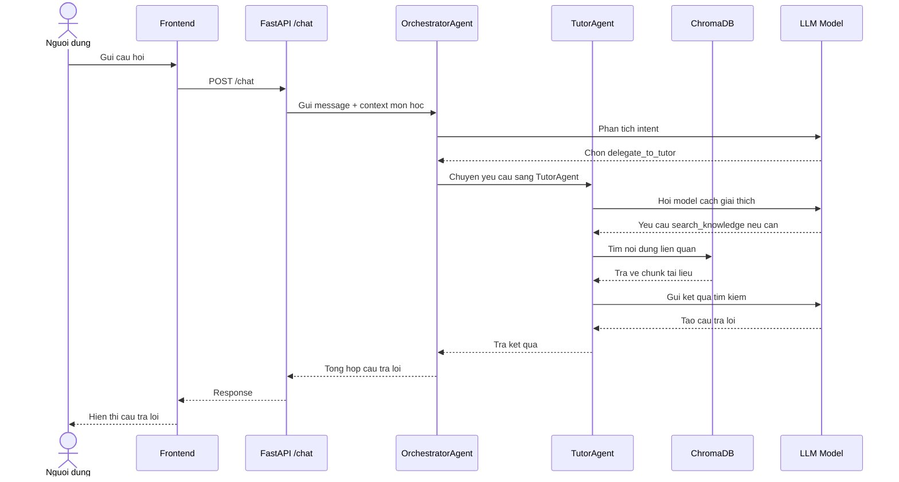
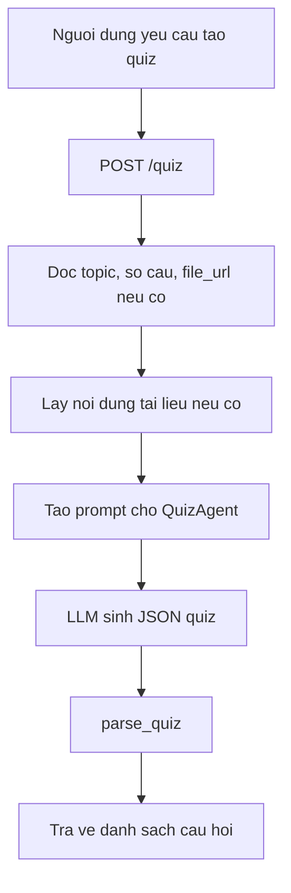

# Phan tich AI Agent va he thong model trong StudyMate AI

## 1. AI Agent la gi?

Trong do an StudyMate AI, AI Agent co the hieu don gian la mot "tro ly hoc tap thong minh" khong chi tra loi cau hoi, ma con biet:

- Hieu nguoi dung dang muon lam gi.
- Chon dung tac vu can xu ly.
- Goi cong cu hoac agent chuyen biet.
- Tim lai kien thuc trong tai lieu da upload.
- Tra ket qua theo dung dinh dang nhu tom tat, quiz, flashcard hoac giai thich bai hoc.

Khac voi chatbot thong thuong, AI Agent trong he thong nay co kha nang dieu phoi nhieu thanh phan. Vi du, khi nguoi dung hoi "Hay tao 10 cau quiz ve dao ham", he thong khong chi gui cau hoi cho model, ma co the chuyen yeu cau sang QuizAgent de tao cau hoi trac nghiem theo dinh dang JSON.

## 2. Tong quan thiet ke AI Agent

He thong AI Agent cua StudyMate AI duoc thiet ke theo mo hinh multi-agent, trong do co mot agent dieu phoi trung tam va nhieu agent chuyen biet.

```mermaid
flowchart TD
    User[Nguoi dung] --> Frontend[Frontend]
    Frontend --> API[FastAPI ai_agent/main.py]

    API --> Chat[/chat]
    API --> Quiz[/quiz]
    API --> Flashcard[/flashcard]
    API --> Summary[/summary]
    API --> Upload[/upload]

    Chat --> Orchestrator[OrchestratorAgent]

    Orchestrator --> Tutor[TutorAgent]
    Orchestrator --> QuizAgent[QuizAgent]
    Orchestrator --> SummaryAgent[SummaryAgent]
    Orchestrator --> FlashcardAgent[FlashcardAgent]
    Orchestrator --> GroupAgent[GroupAgent]
    Orchestrator --> KTAgent[KepnerTregoeAgent]

    Upload --> KB[ChromaDB Knowledge Base]
    Tutor --> KB
    SummaryAgent --> KB
    FlashcardAgent --> KB

    Orchestrator --> Model[LLM qua OpenRouter]
    Tutor --> Model
    QuizAgent --> Model
    SummaryAgent --> Model
    FlashcardAgent --> Model
```

### Cac thanh phan chinh

| Thanh phan | Vai tro |
|---|---|
| `main.py` | Tao API bang FastAPI, nhan request tu frontend, goi agent phu hop |
| `multi_agent.py` | Chua BaseAgent, OrchestratorAgent va cac agent chuyen biet |
| `knowledge_base.py` | Luu va tim kiem tai lieu bang ChromaDB |
| `subject_metadata.py` | Tao thong tin mon hoc tu nhan co san cua nhom/tai lieu |
| `classifier_agent.py` | Module phan loai mon hoc bang AI, hien tai chu yeu dung lam nen tang/ho tro |
| `vocabulary.py` | Xu ly tu vung, import file, tao flashcard va quiz tu danh sach tu |

## 3. Vai tro cua tung agent

| Agent | Chuc nang | Vi du |
|---|---|---|
| OrchestratorAgent | Dieu phoi yeu cau den agent phu hop | "Toi muon on tap" -> chon QuizAgent hoac TutorAgent |
| TutorAgent | Giai thich kien thuc theo cach de hieu, goi mo tu duy | Giai thich dao ham, luc hap dan, cau truc du lieu |
| QuizAgent | Tao cau hoi trac nghiem theo Bloom's Taxonomy | Tao 10 cau quiz muc do understand |
| SummaryAgent | Tom tat tai lieu theo bullet, paragraph, outline, map | Tom tat file PDF bai hoc |
| FlashcardAgent | Tao the ghi nho theo nguyen tac spaced repetition | Tao flashcard cong thuc/to vung |
| GroupAgent | Ho tro chia nhom, phan cong, lich hoc | De xuat vai tro trong nhom hoc |
| KepnerTregoeAgent | Phan tich van de theo phuong phap Kepner-Tregoe | Tim nguyen nhan, danh gia rui ro |

## 4. He thong model hoat dong nhu the nao?

### 4.1. Model la gi?

Model trong he thong nay la mo hinh ngon ngu lon, hay LLM. Co the hieu model nhu "bo nao ngon ngu" giup he thong:

- Doc cau hoi cua nguoi dung.
- Hieu y dinh cua cau hoi.
- Tao cau tra loi tu nhien.
- Tao cau hoi quiz, flashcard, tom tat.
- Quyet dinh khi nao can goi tool.

StudyMate AI khong goi truc tiep mot model co dinh duy nhat. He thong dung OpenRouter, mot cong ket noi den nhieu model khac nhau.

### 4.2. Vi sao can nhieu model?

Trong `multi_agent.py`, moi agent co danh sach model rieng. Neu model dau tien loi, cham, het credit hoac khong phan hoi tot, he thong thu model tiep theo.

Vi du:

```text
QuizAgent:
1. openai/gpt-oss-120b:free
2. deepseek/deepseek-v4-flash:free
3. nvidia/nemotron-3-super-120b-a12b:free
4. meta-llama/llama-3.3-70b-instruct:free
```

Dieu nay giong nhu khi mot giao vien ban ron thi he thong se tu dong hoi giao vien khac. Muc dich la tang do on dinh va giam nguy co he thong bi dung khi mot model gap loi.

### 4.3. Moi agent co the dung model khac nhau

Khong phai tac vu nao cung can cung mot loai model. He thong chia model theo tinh chat cong viec:

| Nhom tac vu | Agent | Yeu cau model |
|---|---|---|
| Giai thich bai hoc | TutorAgent | Can reasoning tot, giai thich tung buoc |
| Tao quiz | QuizAgent | Can tra JSON on dinh, cau hoi dung dinh dang |
| Tom tat | SummaryAgent | Can nhanh, gon, tiet kiem token |
| Flashcard | FlashcardAgent | Can tao noi dung ngan, co cau truc |
| Phan tich van de | KepnerTregoeAgent | Can lap luan logic, phan tich nhieu buoc |

Day la diem manh cua thiet ke: he thong khong dung mot model cho moi viec, ma chon model phu hop voi tung kieu tac vu.

## 5. Luong xu ly mot cau hoi chat

Vi du nguoi dung hoi: "Giai thich dao ham la gi?"



Nguoi moi hoc co the hieu luong nay nhu sau:

1. Nguoi dung dat cau hoi.
2. API nhan cau hoi.
3. Orchestrator xem cau hoi thuoc loai nao.
4. Neu la cau hoi can giai thich, Orchestrator chuyen cho TutorAgent.
5. TutorAgent co the tim lai tai lieu trong ChromaDB.
6. Model tao cau tra loi dua tren prompt va tai lieu tim duoc.
7. Ket qua duoc tra ve frontend.

## 6. Luong tao quiz

Voi tac vu tao quiz, he thong co duong di ngan hon. Endpoint `/quiz` goi truc tiep QuizAgent thay vi luon di qua Orchestrator.



Thiet ke nay tot vi tac vu tao quiz da ro rang. Neu van dua qua Orchestrator thi se ton them mot lan goi model, lam cham va tang chi phi.

## 7. RAG trong he thong la gi?

RAG la viet tat cua Retrieval-Augmented Generation, co the hieu la "sinh cau tra loi co ho tro tim kiem tai lieu".

Trong StudyMate AI:

1. Nguoi dung upload tai lieu.
2. He thong doc noi dung file.
3. Noi dung duoc chia thanh nhieu doan nho.
4. Moi doan duoc embedding va luu vao ChromaDB.
5. Khi nguoi dung hoi, agent tim cac doan lien quan.
6. Model dung cac doan do de tao cau tra loi.

Loi ich cua RAG:

- Cau tra loi bam sat tai lieu cua nguoi dung.
- Giam tinh trang model bia noi dung.
- Phu hop voi ung dung hoc tap theo tai lieu rieng cua lop/nhom.

## 8. Uu diem cua thiet ke hien tai

### 8.1. Ro rang va de trinh bay

Mo hinh Orchestrator + Specialist Agents rat phu hop de dua vao bao cao. Hoi dong co the de dang thay he thong co cau truc, co phan cong nhiem vu, khong phai mot chatbot don gian.

### 8.2. Moi agent co chuyen mon rieng

TutorAgent tap trung giai thich. QuizAgent tap trung tao cau hoi. SummaryAgent tap trung tom tat. Cach chia nay giup prompt gon hon va han che nham lan nhiem vu.

### 8.3. Co RAG voi tai lieu hoc tap

Day la diem rat quan trong. He thong co kha nang dung tai lieu upload lam nguon tri thuc rieng, phu hop voi bai toan hoc tap ca nhan va hoc nhom.

### 8.4. Co fallback model

Neu mot model khong hoat dong, he thong thu model khac. Dieu nay giup demo on dinh hon.

### 8.5. Co endpoint rieng cho tac vu quan trong

`/quiz`, `/flashcard`, `/summary`, `/vocabulary` giup frontend goi dung chuc nang, giam phu thuoc vao viec Orchestrator phai tu doan moi thu.

### 8.6. Co xu ly bat dong bo

FastAPI ket hop `async/await` giup he thong phu hop voi nhieu request cung luc.

## 9. Nhuoc diem va rui ro

### 9.1. Session dang luu trong RAM

Lich su chat duoc luu trong bien `sessions` cua `main.py`. Neu server restart, lich su mat. Neu chay nhieu instance, moi instance co session rieng, gay khong dong bo.

Huong cai thien: dung Redis hoac database de luu session.

### 9.2. Chat qua Orchestrator co the cham

Mot cau hoi chat co the can nhieu lan goi model: Orchestrator goi model de chon agent, sau do agent lai goi model de tao cau tra loi. Neu cau hoi da ro rang, cach nay co the lang phi.

Huong cai thien: dung routing hybrid. Intent ro thi goi thang agent, intent phuc tap moi dung Orchestrator.

### 9.3. JSON output chua that su chac chan

QuizAgent va FlashcardAgent yeu cau model tra JSON, nhung model van co the tra sai dinh dang. He thong co parser fallback, nhung cach tot hon la validate bang schema.

Huong cai thien: dung Pydantic schema, retry khi output sai.

### 9.4. Chia chunk tai lieu con don gian

ChromaDB dang luu chunk theo do dai ky tu. Cach nay nhanh nhung co the cat ngang mot cong thuc, bang bieu hoac mot y nghia.

Huong cai thien: chunk theo doan van, heading, cau hoac semantic chunking.

### 9.5. Bao mat API chua phu hop production

CORS dang mo rong `*`, chua co rate limit rieng cho AI service. Neu dua len production can gioi han domain frontend, xac thuc request va gioi han tan suat.

### 9.6. Nguon RAG chua hien thi ro cho nguoi dung

Agent co the tim trong ChromaDB, nhung cau tra loi cuoi chua luon hien thi "lay tu file nao". Voi ung dung hoc tap, nen co citation de tang do tin cay.

## 10. Huong toi uu de dua vao bao cao

| Muc uu tien | Giai phap | Loi ich |
|---|---|---|
| Cao | Luu session vao Redis/database | Khong mat lich su khi restart, scale tot hon |
| Cao | Routing hybrid cho `/chat` | Giam latency va chi phi model |
| Cao | Validate JSON bang Pydantic | Quiz/flashcard on dinh hon |
| Trung binh | Semantic chunking cho tai lieu | RAG chinh xac hon |
| Trung binh | Tra ve citation tu ChromaDB | Tang do tin cay cau tra loi |
| Trung binh | Logging request_id, model, agent | De debug va danh gia thuc nghiem |
| Thap | Don dep file legacy | De bao tri va tranh nham lan |

## 11. Phan tich he thong model cho nguoi moi hoc

Co the giai thich he thong model bang hinh anh an du sau:

```text
Nguoi dung = hoc sinh dat cau hoi
API = ban tiep nhan yeu cau
Orchestrator = giao vien chu nhiem phan cong
TutorAgent/QuizAgent/... = giao vien bo mon
ChromaDB = thu vien tai lieu cua lop
LLM model = bo nao ngon ngu giup doc, hieu va tao cau tra loi
```

Khi hoc sinh hoi mot cau:

1. Ban tiep nhan nhan cau hoi.
2. Giao vien chu nhiem xem cau hoi thuoc loai nao.
3. Neu can giai thich bai, giao cho giao vien Tutor.
4. Neu can tao de on tap, giao cho giao vien Quiz.
5. Giao vien co the vao thu vien tim tai lieu lien quan.
6. Bo nao ngon ngu model tao cau tra loi cuoi cung.

Vi vay, model khong lam viec mot minh. Model nam trong mot he thong lon hon gom API, agent, tool, prompt, memory va knowledge base.

## 12. Ket luan danh gia

He thong AI Agent cua StudyMate AI da vuot muc chatbot co ban. Diem noi bat la co multi-agent, co Orchestrator, co RAG bang ChromaDB, co model fallback va co cac endpoint rieng cho tung tac vu hoc tap.

Ve mat do an, day la thiet ke phu hop vi the hien duoc ca kien thuc AI Agent lan ung dung thuc te trong giao duc. Tuy nhien, de tien gan production, he thong can cai thien them ve session, bao mat, chat routing, schema validation va citation trong RAG.

Neu trinh bay ngan gon trong bao cao, co the ket luan:

> StudyMate AI su dung kien truc multi-agent ket hop RAG, trong do OrchestratorAgent dong vai tro dieu phoi, cac specialist agent xu ly tung nhiem vu hoc tap, va he thong model LLM qua OpenRouter dam nhan viec hieu ngon ngu, sinh noi dung va goi cong cu. Thiet ke nay giup ung dung linh hoat, de mo rong va phu hop voi moi truong hoc tap ca nhan hoa.

